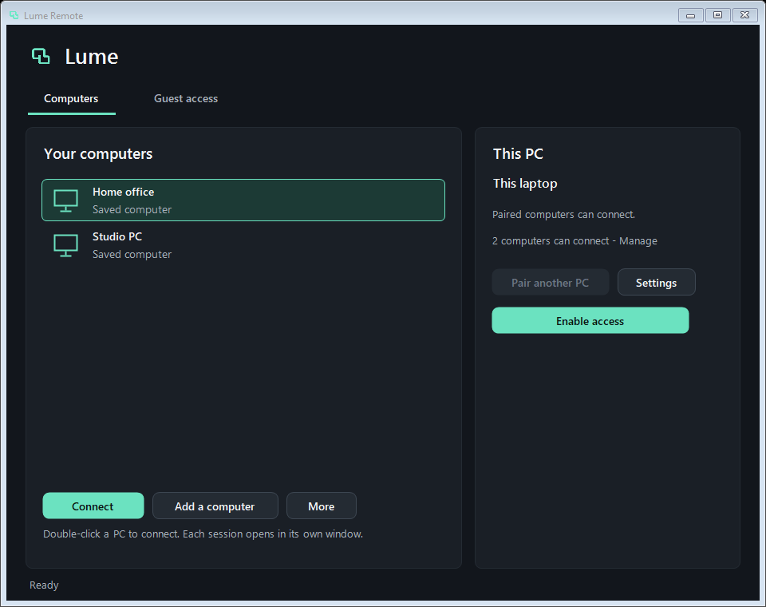
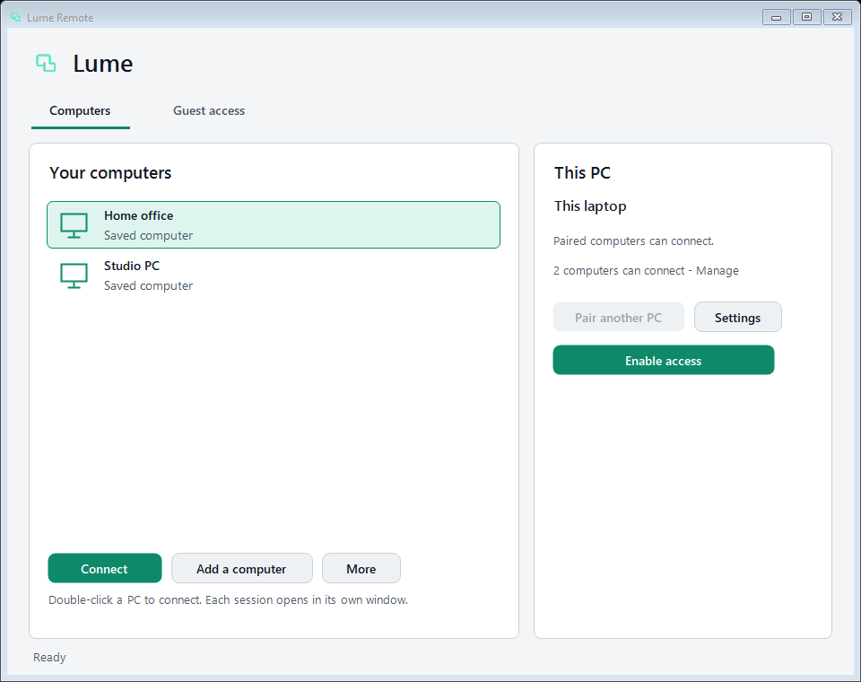

# Lume Remote

Reach your own Windows PCs from anywhere. Pair them once, then connect with one click.
No account, no subscription, no Lume servers.

<p align="center"></p>

**0.12.1 development preview** · Windows 10/11 x64 · MIT ·
[Download](https://github.com/Darkplates/lume-remote/releases) ·
[35-second video](docs/media/lume-promo.mp4) ·
[Security](docs/SECURITY.md)

## Why Lume

There are good, established remote desktop tools. Lume is for a narrower case:
**your own computers, without handing a vendor the keys.**

- **Nothing to sign up for or pay.** There is no account, licence check,
  commercial-use detection or session timer.
- **No Lume servers to trust or host.** Screen, input and files go directly
  between your PCs. You don't need to run your own server to get this.
- **Native and inspectable.** It's a native Windows app with no bundled runtime,
  browser engine or background updater. Anyone can read and build the source.
- **You stay in control.** Unattended access is opt-in and can be revoked at once.
  A visible "… is connected" pill with a Disconnect button shows on the controlled
  PC. Every guest must be approved on screen.

If you need managed fleets, mobile-first control or guaranteed traversal of every
network, an established product will serve you better today.

## How a connection works (and who hosts what)

| Step | What happens | Who runs it |
| --- | --- | --- |
| Introduction of saved PCs | The two PCs exchange a small encrypted, authenticated message to find each other. | Public [PeerJS](https://peerjs.com) broker (`0.peerjs.com`), a third party. It sees which IDs talk and when, **not** the content. |
| Introduction of guests | The invitation and reply are copied and pasted by the people involved. | Nobody. No server is involved. |
| Address discovery | Each PC learns its public address. | Cloudflare STUN (`stun.cloudflare.com`). It carries no desktop data. |
| The session itself | Screen, input, clipboard and files over a direct WebRTC data channel, with Lume's own pinned TLS inside. | Your two PCs. |
| When a direct route is impossible | Some NAT/firewall combinations block direct connections. There is no automatic TURN relay. | You: use LAN/VPN or run the included [TCP relay](relay/relay.py), which only forwards encrypted bytes. |

If the public broker is unavailable, saved-PC reconnection waits. Guest invitations,
LAN/VPN and your own relay still work.

## Security model

- **Pinned TLS.** Each session has a new certificate. The viewer checks its exact
  SHA-256 pin, then sends a fresh session secret. No certificate authority is trusted.
- **Authorization first.** No screen capture or input happens until you approve a
  guest or a paired PC is verified. Pairing codes work once and expire after 15 minutes.
- **Hardened background service.** Unattended access runs as a Windows service that
  only works for the PC's owner. Its settings can only be changed through an
  authenticated channel, and access can be revoked or disabled instantly.
- **Bounded parsing.** Every network parser and queue has a fixed limit.
- **Secret-free logs.** Nothing that could replay a session is logged: no invitations,
  keys, connection offers or desktop content.

A security issue in the unattended-access service was found in review, fixed and
disclosed in
[GHSA-hp7w-v83m-qgx8](https://github.com/Darkplates/lume-remote/security/advisories/GHSA-hp7w-v83m-qgx8).
**This project has not had an independent security audit.** Please report issues
privately as described in [SECURITY.md](SECURITY.md).

## Get started

1. Download the Windows ZIP from [Releases](https://github.com/Darkplates/lume-remote/releases),
   check its SHA-256, extract the whole ZIP on both PCs and open `START.bat`.
2. On the PC you want to reach, choose **Enable access** and approve the Windows prompt.
3. Choose **Pair another PC**. On your other PC, choose **Add a computer** and paste the code.
4. Double-click the saved PC to connect.

For a one-off guest, use **Guest access**. The guest's request needs your approval.

| Dark | Light |
| --- | --- |
|  |  |

More in the [user guide](docs/USER-GUIDE.md): quality presets, files and clipboard,
updating an installed host, and connectivity limits.

## Status

This is an unsigned development preview for careful testing.

- **Windows** is the main platform.
- **Linux, Android and the other ports** are partial. See [portable roles](ports/README.md)
  and [feature status](docs/FEATURES.md).
- **macOS and iOS** have not been compiled or tested, because no Apple hardware is available.
- **Performance** has not been compared with other products, so no such claims are made.

## Build from source

Needs Git, Python 3, Visual Studio 2022 C++ Build Tools with the Windows 10 SDK, and
.NET Framework 4.8.

```powershell
.\scripts\build-all.ps1 -Tests
.\scripts\verify.ps1 -Safe
```

No NuGet, npm, Electron or separate runtime is involved. Pinned WebRTC sources are
downloaded and hash-verified. See [architecture](docs/ARCHITECTURE.md),
[contributing](CONTRIBUTING.md) and [dependency licenses](THIRD-PARTY-NOTICES.txt).

## How it is built

Lume is developed by one person with heavy use of AI coding assistants. Design
decisions, reviews and releases are made by the maintainer. Every change goes
through automated Windows and Linux CI, and security-sensitive work gets separate
review. Critical reviews and bug reports are the most useful contributions.
