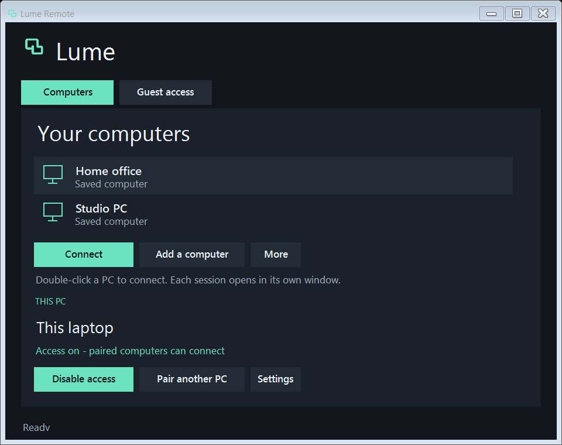

# Lume Remote

A small, native remote desktop app for Windows. Pair your PCs once, then connect with one click.

**0.12.1 development - public source preview** · Windows 10/11 x64 · .NET Framework 4.8 · MIT application source

[Windows CI](https://github.com/Darkplates/lume-remote/actions/workflows/windows.yml) ·
[Linux CI](https://github.com/Darkplates/lume-remote/actions/workflows/portable.yml) ·
[Development downloads](https://github.com/Darkplates/lume-remote/releases) ·
[Demo walkthrough](docs/DEMO.md) · [Benchmark protocol](docs/BENCHMARKS.md)

The source also includes separate Linux/macOS native desktop and Android/iOS viewer
projects. These are partial platform implementations, not feature-equivalent
replacements for the Windows build. Read [portable roles and build instructions](ports/README.md)
and the [acceptance status](docs/FEATURES.md) before using or distributing them.

**Apple status:** macOS and iOS/iPadOS projects are prepared but have not been
compiled or tested. We do not have Apple devices available. Source code and build
scripts are not evidence of working Apple applications. This limitation is explicit
and must remain visible in releases until real Apple verification is performed.



## Get connected

1. Obtain the complete Windows development ZIP from [Releases](https://github.com/Darkplates/lume-remote/releases), or build from source using the instructions below. Extract the **whole ZIP** on both PCs and open `START.bat`. Check the producing commit, SHA-256 and workflow result. Releases are unsigned previews for testing.
2. On the PC you want to control, choose **Enable access** and approve Windows setup.
3. Choose **Pair another PC**. On your other PC, choose **Add a computer** and paste that one-time code.
4. Double-click the saved PC to connect.

A guest can use **Guest access** without enabling permanent access. Guest sharing requires local approval.

Closing the main window hides it in the Windows notification area. Remote windows stay open. Double-click the tray icon to bring the dashboard back. You can control several different PCs at once, each in its own window. **Disconnect** closes only that session. **Exit Lume and disconnect viewers**, in the tray menu, closes all viewers; an enabled host service continues running.

## What changed

The first public launch preparation also fixes complete Windows SDK selection,
the Linux GBM build prerequisite, and a race between consecutive file-transfer
completion receipts. It includes an offline interface walkthrough and opt-in local
benchmark tools. No controlled competitor performance results are published yet.

0.12 adds authenticated single-file resume to paired portable connections, drawing
controls in portable viewers for Windows hosts, and explicit local PDF printing
adapters. See [scope and limits](docs/PORTABLE-COLLABORATION.md) and
[verification](docs/PORTABLE-12-VERIFICATION.md). The dependency notice inventory now
records exact provenance and its remaining Apple-only exception.

This public source preview is intended for contributors and testing. It does not
claim complete cross-platform parity, a security audit, signed binaries, or measured
superiority over other products. Production release gates remain open.


0.11 adds recursive folder upload/download to portable viewers, with empty folders,
new collision-safe roots, per-file SHA-256, progress and cancellation. Android uses
the system document-tree picker; iOS folder-picker source remains uncompiled.
Portable MKV recording now has a source/custom FPS target and coalesced frame
wakeups instead of a fixed 33 ms sleep. Received frames and encoding throughput
determine actual output. See [0.11 verification](docs/PORTABLE-11-VERIFICATION.md) and the
[AGY review and corrections](docs/AGY-11-REVIEW.md). Folder retry
creates a new root; folder jobs do not resume automatically. Apple remains untested.

0.10 adds live display selection to portable hosts/viewers and presents new frames
through desktop wakeups or Android/iOS display callbacks, removing fixed 16/33 ms
UI intervals. Input remains tied to the displayed image generation. Apple build
preflight, universal bundle checks and a Finder launcher are prepared for a future
Mac; Apple compilation/execution remains explicitly unverified. See
[portable display and Apple preparation](docs/PORTABLE-10-WORK.md) and the
[0.10 verification report](docs/PORTABLE-10-VERIFICATION.md).

0.9 adds automatic recovery of saved portable sessions, owner-enabled Linux/macOS
hosts at graphical sign-in, and portable sound, consented voice and local MKV
recording. Linux host credentials use the desktop keyring; macOS source uses
Keychain. The Linux runtime has isolated VM evidence; Android device execution
and Apple compilation/execution are still unverified. The macOS build now targets
13 or later for system-audio capture. See [access and file boundaries](docs/PORTABLE-ACCESS.md)
and [portable media](docs/PORTABLE-MEDIA.md). The [0.9 verification report](docs/PORTABLE-09-VERIFICATION.md)
separates compiled code, native VM checks and the remaining device acceptance.

The existing Windows feature set remains:

- Negotiate exact PNG source pixels with the portable viewers while retaining Windows-to-Windows XPRESS/H.264 defaults. Windows/Rust interoperability has synthetic TLS and native P2P fixtures.
- Copy whole folders in either direction, including nested/empty folders and collision-safe destination names.
- Read remote clipboard text explicitly; opt into paired text sync for the current session. Conflicting edits pause sync without replacing either copy.
- Switch the remote display live. Frames and input carry a display generation so delayed clicks cannot target the wrong display.
- Use session chat and temporary on-screen annotations. Drawing mode releases and suppresses keyboard/mouse control.
- Enable remote system audio explicitly. Start a two-way voice call only after both users allow their microphones; the host keeps a visible Stop microphone control.
- Record MP4 with optional system audio and a selectable frame-rate target, including the source refresh rate. REC remains visible and normal close finalizes the container. The fixed canvas supports up to 4096 x 2160; changed display sizes are letterboxed.
- Resume an interrupted paired file by retrying the same source and destination. Authenticated journals and prefix/full-file SHA-256 checks prevent accepting a different or corrupt partial copy.
- Add owner-approved network folders in Settings; access uses the signed-in owner's permissions.
- Select a remote PDF in Files, choose **Print PDF locally**, preview it and choose a Windows printer.
- Request Lock, Restart or Shut down from an authorized paired session, with explicit confirmation. Native power actions still require hardware acceptance.
- Keep blocking session workers off the shared thread pool used for short requests and callbacks.

Earlier stability improvements retained:

- Independent network heartbeats keep static or minimized sessions alive without relying on the UI.
- Saved sessions automatically reconnect after transport failures. Each attempt uses fresh session credentials. Disconnect cancels recovery.
- Frames decode and acknowledge outside the UI; only the newest completed image waits for display.
- A smaller HUD, a new icon, simple presets, and advanced details behind **More**.
- Optional H.264 encoding through Windows Media Foundation, with hardware detection and software fallback. Lossless and JPEG modes remain available.
- Local, bounded connection event logs without invitation codes, keys, peer names or exception messages.
- Bidirectional file transfer with a remote folder browser, multiple-file batches, progress, cancellation and SHA-256 verification. Existing files are kept.
- Explicit clipboard text now works for paired computers. Duplicate actions and a busy clipboard no longer end the desktop session; success is confirmed by the host.

There is **no subscription, account, commercial-use check or session-duration cap**. Each host accepts one viewer at a time. Network timeouts and parser bounds protect resources; a broken network or sleeping computer can still interrupt a connection.

## Quality

| Preset | Resolution and frame-rate target | Encoding |
| --- | --- | --- |
| Source | Original resolution and display refresh | Lossless, exact pixels |
| Smooth video | Up to 1080p, 60 FPS target | H.264, hardware when available |
| Save data | Up to 360p, 10 FPS target | JPEG |
| Custom settings | Independent resolution, FPS and compression | Selectable |

H.264 uses lossy 4:2:0 colour sampling. Choose Source for exact text and colours. Hardware detection is reported in **More → Connection details**. The current decoder and pixel conversions use CPU work. Selecting 180 FPS does not establish that either PC or the network can deliver it. Unchanged screens send fewer images.

## Updating an existing installation

Extract into a new folder and close the old viewer on the controlling PC. Open the new copy there.

If the target already has permanent access enabled, run **UPDATE-HOST.bat** from the new folder, or use **Settings → Update installed host**. Windows requests administrator permission; the host restarts and the old installed dashboard closes. Pairings and the enabled/disabled access setting are preserved. A backup of replaced installation files is retained. If the old dashboard is hidden, exit it from its tray menu before updating.

Use the new viewer for automatic recovery. Both endpoints need 0.6 for resume, network-folder discovery and voice. The earlier tools/folders need 0.5. Versions 2 and 3 retain their original layouts; an older viewer can fall back to protocol 2 on a newer host. Image-mode protocol compatibility with 0.3 is tested locally.

## Files and clipboard

In a connected session, choose **Files**, open a remote drive and folder, then **Send files** or **Receive selected**. You can select files or folders, use **Send folder**, drag local items into the remote list, and cancel a batch. The desktop remains connected. Files use the same authenticated, encrypted connection; no cloud upload is involved.

Choose **More → Send clipboard text** to copy local text to the remote PC. A paired computer uses the permission already granted; a guest's text still requires local acceptance. Use **Get remote clipboard text** for the opposite direction. **Sync clipboard text** is an explicit paired-session opt-in; it stops at disconnect and starts disabled after reconnection.

File access follows the signed-in owner's Windows permissions. It supports ordinary files on local fixed/removable volumes and explicitly configured network roots, without an application file-size quota; free space, Windows permissions, 240-character paths and throughput still apply. Linked folders remain denied. Folder copies preserve empty directories and nested content. Cancellation keeps completed items and deletes the active partial. A network interruption preserves paired single-file resume state: retry the same file into the same destination to verify and reuse its prefix. This is not automatic batch/folder resume; retrying a folder creates a new unique root. Guest transfers do not retain resumable state. See [security details](docs/SECURITY.md).

## Connectivity and scope

Saved access uses encrypted messages through the public PeerJS signaling service, and Cloudflare STUN for address discovery. The desktop travels through the peer connection. These external services have their own availability and policies. Some network combinations require a reachable relay; no automatic TURN service or free hosted relay bandwidth is supplied. Manual P2P signaling, LAN/VPN connections and a self-hosted TCP relay are available.

An always-on helper in the remote network or suitable router support is needed for Internet wake. The sleeping PC also needs compatible hardware, firmware, standby power and network configuration. Physical wake and secure-desktop behaviour are separate acceptance checks.

This is an unsigned Windows development build. System audio, consented voice, AAC recording and PDF print forwarding are implemented; physical audio devices, real SMB shares and a physical printer still need commissioning. PDF printing uses the Windows renderer and a local printer dialog; it is not a virtual Lume printer driver for arbitrary remote applications. Export other formats to PDF first. An automatic updater is not included. Portable implementations are partial and have separate acceptance gates; macOS is explicitly untested. Feature parity or performance superiority over other remote desktop products has not been established. The owner authorized this public development source checkpoint; stable binary release criteria remain open. See [release contract](docs/PARITY-CONTRACT.md), [validation](docs/VALIDATION.md), [feature status](docs/FEATURES.md) and [security](docs/SECURITY.md).

## Build from source

Install Git, Python 3, Visual Studio 2022 C++ Build Tools with the Windows 10 SDK (including UnionMetadata/Windows.winmd), and .NET Framework 4.8. Then run:

```powershell
.\scripts\build-all.ps1 -Tests
.\scripts\verify.ps1 -Safe
.\tests\LumeTests.exe --idle-soak 45
```

`BUILD.bat` performs the complete build. Pinned WebRTC sources and a hash-verified CMake are downloaded into the local build folder. No NuGet, npm, Electron or separate app runtime is required. After native dependencies are built, `scripts/build.ps1` rebuilds only the managed app. `scripts/package.ps1` creates a portable archive without private settings or test output.

[Architecture](docs/ARCHITECTURE.md) · [Contributing](CONTRIBUTING.md) · [Dependency licenses](THIRD-PARTY-NOTICES.txt) · [Validation](docs/VALIDATION.md)

For the public launch approach and reproducible comparisons, see [launch plan](docs/LAUNCH-PLAN.md).
